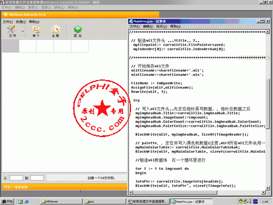

# WilViewer

Repository mirror of WilViewer.

> The source code was downloaded from http://www.2ccc.com/btdown.asp?articleid=3482.

## Original Remark

### Wilextracter v1.0 测试版

可以打开一个 `*.wil` 文件并直接提取其中的图片序列资源以形成一个 `*.wil` 文件（缺省利用原位图文件的调色板）。

不像 WilEdit 那么麻烦，省去了私服工作者的大量劳动。

在源代码的基础上经过改进，改动 Mir2 引擎的几个绘图函数，就可以得到一个真彩 Wil 编辑器（我正在往这方面努力）。

#### 使用方法

先打开一个 `*.wil` 文件，在软件下面二个文本框中填你要提取的起始图片号到结束号，点“创建 WIL 到”按钮，填写要保存到的文件名就可以了（会自动生成文件名加 wil、wix）。

一定要保证起始号小于结束号，不要填其它字符，并且用普通的数字就可以了，不要在前面加 0。

本人成功实现 Mir2 真彩，说穿了真的好简单哦，技术难点是 COM HOOK 和函数改写。
